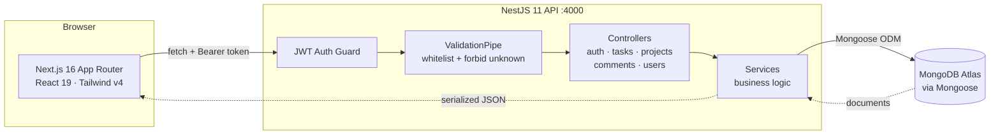
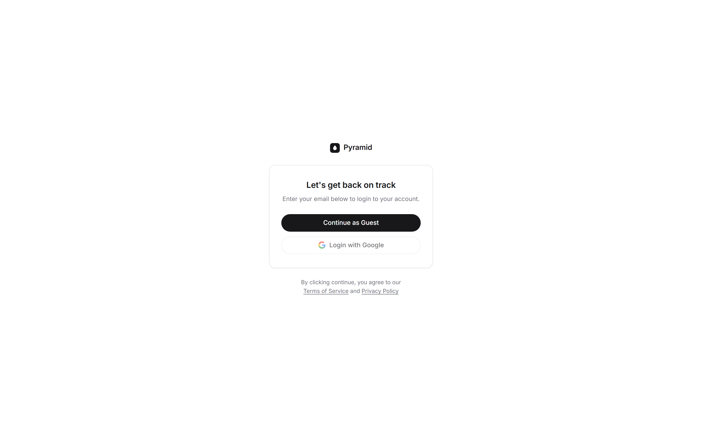
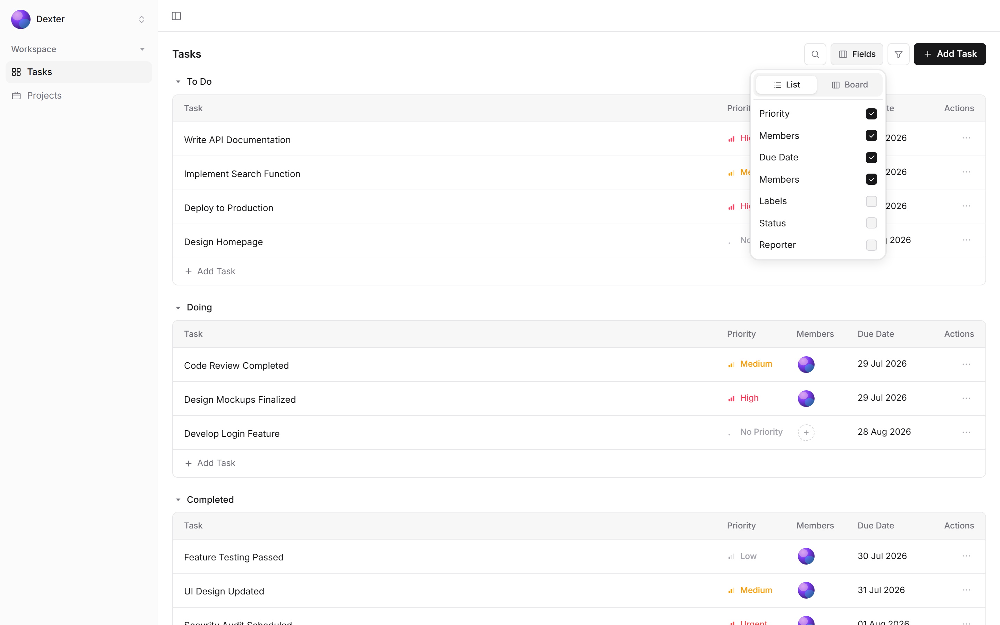
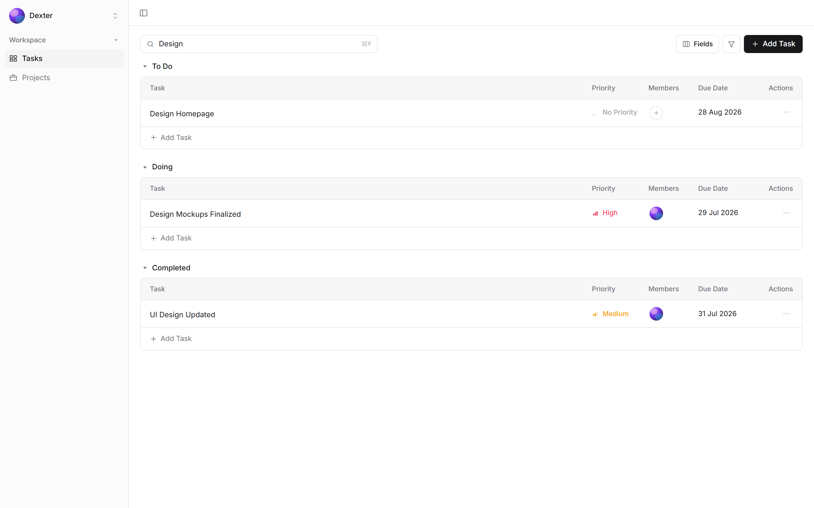
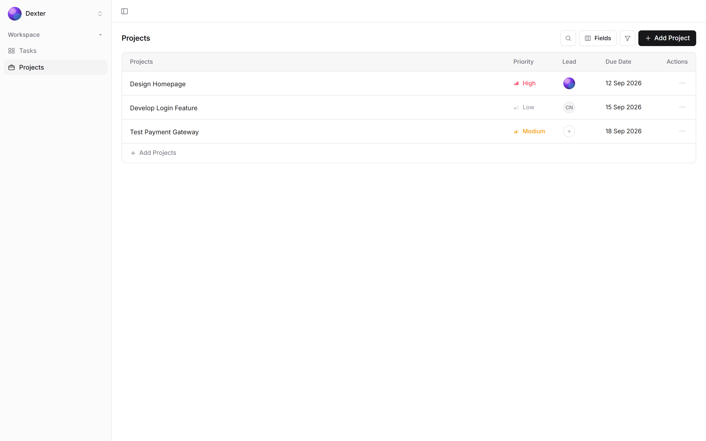
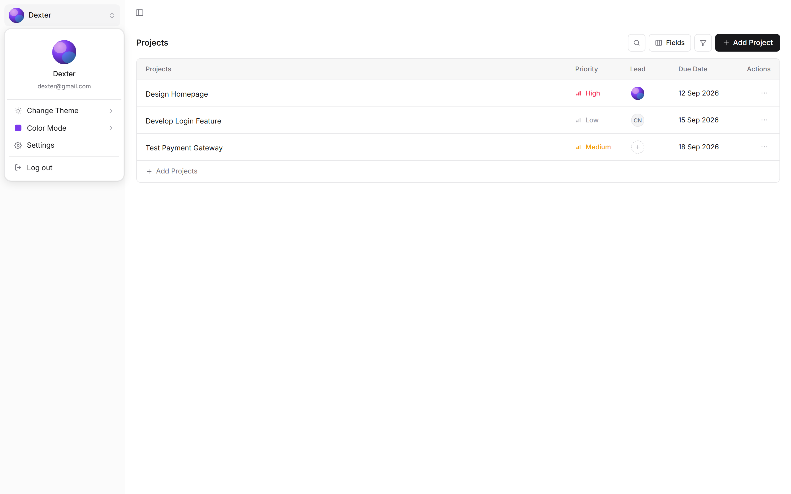
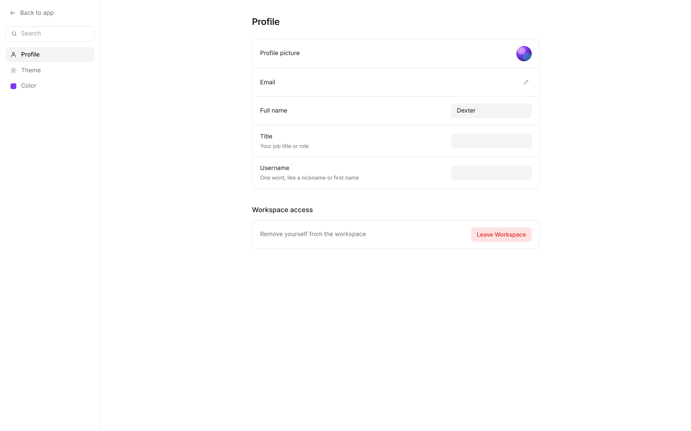
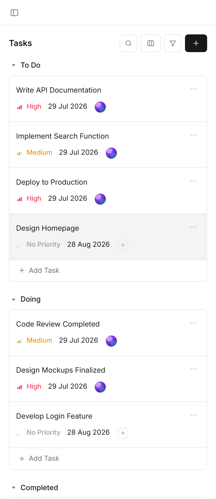
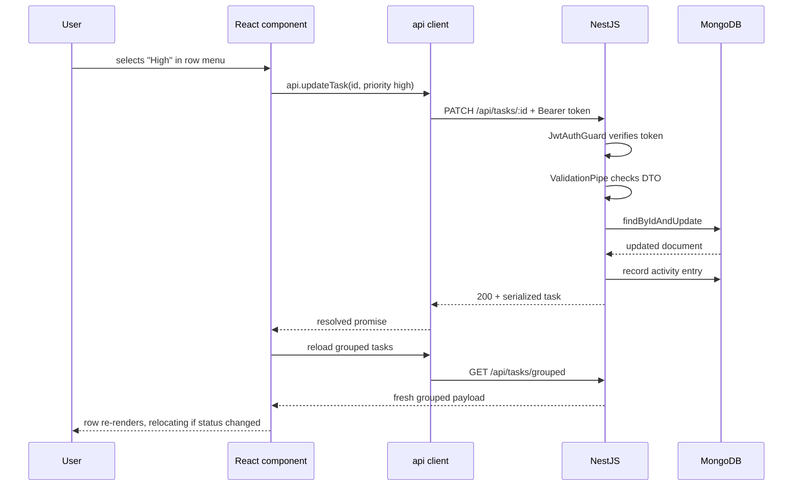

# Pyramid — Project Walkthrough

A task-and-project management application built with Next.js and NestJS, backed by MongoDB Atlas.

**Author:** Janmejoy Mahato
**Date:** 21 August 2026

---

## Table of Contents

1. [What This Application Does](#1-what-this-application-does)
2. [Architecture Overview](#2-architecture-overview)
3. [Walkthrough: Authentication](#3-walkthrough-authentication)
4. [Walkthrough: The Task List](#4-walkthrough-the-task-list)
5. [Walkthrough: Board View](#5-walkthrough-board-view)
6. [Walkthrough: Search & Filtering](#6-walkthrough-search--filtering)
7. [Walkthrough: Task Detail](#7-walkthrough-task-detail)
8. [Walkthrough: Projects](#8-walkthrough-projects)
9. [Walkthrough: Settings & Theming](#9-walkthrough-settings--theming)
10. [Responsive Behaviour](#10-responsive-behaviour)
11. [Data Flow: How a Change Persists](#11-data-flow-how-a-change-persists)
12. [Verification & Test Results](#12-verification--test-results)
13. [UX/UI & Functionality Improvements Identified](#13-uxui--functionality-improvements-identified)
14. [Known Limitations](#14-known-limitations)

---

## 1. What This Application Does

Pyramid is a workspace for tracking tasks and projects. A user signs in, sees their
tasks grouped by status, and can move work through a pipeline of four stages:
**To Do → Doing → Completed → On Hold**.

The same task data is presented two ways — as grouped tables (list view) and as
Kanban columns (board view) — and every task opens into a detail page carrying
description, labels, subtasks, comments and an activity feed.

The core design goal is that **nothing is a local-only illusion**. Every visible
control writes through to the database. Change a priority in a dropdown, reload the
page, and the change is still there.

---

## 2. Architecture Overview

The project is a two-package repository: a Next.js frontend and a NestJS API,
talking over REST, with MongoDB Atlas for storage.



### Layout of the code

| Path | Responsibility |
|---|---|
| `frontend/src/app/` | Routes — `/`, `/tasks`, `/tasks/[id]`, `/projects`, `/projects/[id]`, `/settings` |
| `frontend/src/components/layout/` | App shell, sidebar, page toolbar, user menu |
| `frontend/src/components/tasks/` | List, board, detail view, details panel, inline add, cell editors |
| `frontend/src/components/ui/` | Shared primitives — button, menu, avatar, chips, icons |
| `frontend/src/lib/` | API client, hooks, types, theme, constants |
| `backend/src/<feature>/` | One module per feature: controller + service + DTOs |
| `backend/src/schemas/` | Mongoose schemas — user, task, project, comment, activity |

### Key architectural decisions

**A single grouped endpoint feeds both views.** `GET /api/tasks/grouped` returns
tasks already bucketed by status. List and board render the same payload, so the
two views can never disagree. Switching between them costs no network request.

**Mutations re-fetch rather than patch local state.** Every write calls the API and
then reloads the grouped payload. This trades a little latency for the guarantee
that what you see is what the database holds — no optimistic-update drift.

**The status vocabulary is defined once per side.** `backend/src/common/constants.ts`
declares the four statuses and five priorities; the API rejects anything outside
that set at the validation boundary. The frontend mirrors it in
`frontend/src/lib/constants.ts`.

**Theming is two independent axes.** `data-theme` (light/dark) and `data-accent`
(six colours) are separate attributes on `<html>`, driving CSS custom properties in
`globals.css`. No component hardcodes a colour — they all read `var(--token)`.

---

## 3. Walkthrough: Authentication



The entry screen offers **Continue as Guest**. Clicking it calls
`POST /api/auth/guest`, which creates a throwaway user document and returns a signed
JWT plus the user object.

The token is stored in `localStorage` under `pyramid.token`. On every subsequent
page load, `AuthProvider` reads that token and calls `GET /api/auth/me` to resolve
it back to a user. If the token is expired or revoked, it is discarded and the app
falls back to the anonymous state rather than erroring.

Each guest login creates a *distinct* user, so two people testing the app never
share a board.

> **Note on "Login with Google":** the button is present to match the design, but
> OAuth is not wired up. See [Known Limitations](#14-known-limitations).

---

## 4. Walkthrough: The Task List


This is the default landing view. Tasks are grouped into one table per status, each
with its own header row and its own **Add Task** affordance.

**Columns.** Task, Priority, Members, Due Date, Actions. Which optional columns
appear is controlled from the Fields menu — the defaults shown here are Priority,
Members and Due Date.

**Priority** renders as a coloured bar-chart glyph plus a label, with the colour
carrying the semantics: Urgent and High in red tones, Medium amber, Low grey.

**Inline creation.** Clicking *Add Task* at the foot of any group opens a text field
in place. Typing a title and pressing Enter creates the task in that group's status
with a due date defaulted one week out, so a new row is never missing a date.

**Row actions.** The `⋯` menu on each row exposes priority, status and delete. Both
priority and status changes write immediately and relocate the row if its group
changed.

---

## 5. Walkthrough: Board View


The Fields menu carries a List/Board switch. Board view renders the same four
statuses as columns, each showing a count in its header.

Cards surface more than list rows do: assignee with avatar, a due-date chip, and
the task's labels as individual chips. The due-date chip uses a red-tinted
background — the design treats due dates as attention-carrying, not neutral
metadata.

Each column has its own **Add Task** at the foot, creating directly into that
column's status.

---

## 6. Walkthrough: Search & Filtering



**Fields** controls both the view switch and per-column visibility, with checkbox
rows for Priority, Members, Due Date, Labels, Status and Reporter.

**Search** is available from the toolbar's magnifier or via <kbd>⌘F</kbd> /
<kbd>Ctrl+F</kbd>, which is intercepted so the app's own search opens instead of the
browser's. The title collapses into an input while search is active. Input is
debounced, so typing does not fire a request per keystroke — and because filtering
runs client-side against the already-grouped payload, results are instant.

**Filter** offers a grouped menu with a priority flyout. While a filter or query is
active, empty groups are hidden rather than shown as empty tables.



---

## 7. Walkthrough: Task Detail


*Captured after the section 13.1 fix — the subtask table and the comment thread now
carry distinct headings.*

Clicking any task opens its detail page — a two-column layout with content on the
left and a **Details** panel on the right.

**Editable header.** Title and description are click-to-edit; they save on blur, so
there is no separate save button.

**Properties, Labels, Resources** sit directly beneath, matching the design's
metadata block.

**Subtasks** render as a nested table reusing the same table component as the main
list, so priority and member editing behave identically at both levels.

**Comments** support threaded replies, posting through
`POST /api/comments/:taskId`. The composer retains its text if a post fails, so
nothing is lost.

**The Details panel** carries Status, Priority, Members, Dates, Labels, Teams and
Reporter. Editing here writes the same way as the list's inline editors.

**Updates** shows an activity feed — priority changes and posted updates are
recorded server-side as activity documents.

---

## 8. Walkthrough: Projects



Projects use the same table shell as tasks, with columns for Priority, Lead and
Due Date. Creation is inline via *Add Projects*, and each project opens to a detail
page listing that project's tasks — the task list scoped by `projectId`.

The Members cell shows three states visible in the screenshots above: an avatar
image when the member has one, initials in a circle as fallback (`CN`), and a
dashed `+` placeholder when unassigned.

---

## 9. Walkthrough: Settings & Theming



The sidebar's user chip opens a menu with Change Theme, Color Mode, Settings and
Log out.



Settings has three sections. **Profile** offers editable Email, Full name, Title and
Username fields that save on blur through `PATCH /api/users/me` — verified to
survive a page reload. **Theme** switches light/dark. **Color** picks among six
accents.


Dark mode is a genuine re-themed palette, not an inversion: surfaces, borders,
table headers and priority colours all have separate dark values, with priority
tones brightened for contrast against dark backgrounds.

---

## 10. Responsive Behaviour

Verified at five widths. **No horizontal overflow at any breakpoint** — measured by
comparing `scrollWidth` against `clientWidth`.

| Width | Layout behaviour | Overflow |
|---|---|---|
| 1440px | Full two-pane layout, sidebar 228px | None |
| 1280px | Same, sidebar 210px | None |
| 1024px | Same, toolbar labels intact | None |
| 768px | Sidebar becomes overlay drawer | None |
| 390px | Tables restructure into stacked cards | None |



The mobile treatment is the notable one. Rather than horizontally scrolling a
five-column table, each row becomes a card with the title on one line and priority,
due date and assignee on a second. Toolbar buttons drop their text labels and become
icon-only, and the sidebar converts to a drawer with a scrim, body-scroll lock, and
Escape-to-close.

---

## 11. Data Flow: How a Change Persists

Changing a task's priority from a row menu:



The re-fetch at the end is what keeps list and board consistent without duplicating
optimistic-update logic per view.

### Validation boundary

The API runs a global `ValidationPipe` with `whitelist: true` and
`forbidNonWhitelisted: true`. Unknown fields are rejected as 400 rather than
silently ignored, so a typo'd field name fails loudly. Enum values are constrained
at the DTO:

- **Statuses:** `To Do`, `Doing`, `Completed`, `On Hold` (Title Case)
- **Priorities:** `urgent`, `high`, `medium`, `low`, `none` (lowercase)

Errors flow through an `AllExceptionsFilter` producing a consistent shape
(`statusCode`, `error`, `message`, `path`, `timestamp`), and the frontend's
`ApiError` carries the status code so callers can distinguish 401 from 400.

---

## 12. Verification & Test Results

All checks below were run against the application and produced the stated output.

### Build & static analysis

| Check | Result |
|---|---|
| Frontend TypeScript (`tsc --noEmit`) | Clean |
| Backend TypeScript | Clean |
| Frontend production build (7 routes) | Success |
| Backend build (`nest build`) | Success |
| Frontend ESLint | 0 problems |
| Backend ESLint | 0 problems |

### API verification

Tested against a live MongoDB Atlas connection:

- `GET /api/health` → 200
- `GET /api/tasks` unauthenticated → 401
- `POST /api/auth/guest` → 201 with valid JWT
- Full CRUD round-trip: create → read → update → delete → confirm 404

### Interaction suite

`frontend/test/ui-check.mjs` drives every interactive control in a real Chromium
browser and asserts each change persisted through the API.

```
=== login ===               PASS  guest login navigates to /tasks
                            PASS  seeded data renders from MongoDB
=== create task ===         PASS  Add Task opens an inline field
                            PASS  new task appears
=== row actions ===         PASS  row actions menu opens
                            PASS  priority change persists
                            PASS  status move relocates the task
=== board view ===          PASS  board renders columns
                            PASS  task visible on board
=== task detail ===         PASS  navigates to task detail
                            PASS  title edit persists
                            PASS  description edit persists
=== details panel ===       PASS  status dropdown opens
                            PASS  members picker opens
=== subtasks + comments === PASS  subtask created
                            PASS  comment posted
=== projects ===            PASS  project created
                            PASS  project deleted
=== settings + theme ===    PASS  profile name persists after reload
                            PASS  theme switch applies
=== cleanup ===             PASS  task deleted

passed: 21  failed: 0
console errors: none
```

### Browser console

Zero errors captured across login, list, board, search, task detail, projects,
settings, dark mode, and all five responsive widths.

---

## 13. UX/UI & Functionality Improvements Identified

Ordered by impact. Item 1 is a defect found during this walkthrough and has since
been fixed; the rest are opportunities.

### 1. Bug: the comments section was labelled "Subtasks" — *fixed*

On the task detail page, the comments heading read **"Subtasks"** — the same label
as the subtask table directly above it, so two adjacent sections carried the same
heading.

Source: `frontend/src/components/tasks/task-detail-view.tsx:368`. The surrounding
code comment already read `{/* Comment thread */}`, confirming the label was simply
wrong rather than intentional.

**Fixed:** the heading now reads "Comments". Verified in the running application —
the detail page renders exactly one `Subtasks` heading and one `Comments` heading —
and the full interaction suite still passes 21/21. The screenshot in
[section 7](#7-walkthrough-task-detail) shows the corrected state.

### 2. No drag-and-drop on the board

The board is the natural place to expect dragging a card between columns, and the
column headers already render a grip handle implying it. Status changes currently
require the row/card `⋯` menu.

**Suggested:** add pointer-based drag with a keyboard-accessible fallback. This is
the single largest UX gap relative to what a Kanban board implies.

### 3. Several filter categories are non-functional

The Filter menu lists Status, Members, Due Date, Teams, Labels and Reporter, but
only **Priority** has a working flyout. The others open submenus with no options.

**Suggested:** either implement them or hide unimplemented entries — a menu item
that does nothing is worse than an absent one.

### 4. The Fields menu lists "Members" twice

`FIELD_ITEMS` contains two entries labelled "Members" (keys `members` and
`assignees`). This mirrors the design, but in a live product two identically
labelled checkboxes that toggle different columns is confusing.

**Suggested:** relabel to distinguish them, e.g. "Members" and "Assignees".

### 5. No optimistic UI on mutations

Every change round-trips before the UI updates. On a fast local connection this is
imperceptible; on a slow one, controls feel unresponsive.

**Suggested:** apply the change locally first and reconcile on response, rolling
back on failure. Worth doing only with proper rollback — the current approach is
correct, just not the fastest.

### 6. Mutation errors are silent

`createTask`, `deleteTask` and the change handlers `await` the API without catching.
A failed request leaves the UI unchanged with no explanation.

**Suggested:** a toast on failure. The comment composer already models the right
behaviour by retaining its text on error.

### 7. No loading skeletons

Views render `loading` states but not shaped placeholders, so there is a brief empty
flash before data arrives — most noticeable on the roughly 20-second Atlas cold
start.

**Suggested:** skeleton rows matching final row height, which also prevents layout
shift.

### 8. No confirmation on delete

Deleting a task or project from the `⋯` menu is immediate and irreversible.

**Suggested:** an undo toast — less interruptive than a confirmation dialog and it
recovers the more common regret case.

### 9. Backend hardening for production

Not needed for an assessment, but flagged for completeness:

- **No rate limiting.** `POST /api/auth/guest` creates a user document per call
  and is unauthenticated — trivially spammable. `@nestjs/throttler` would fix this.
- **No security headers.** Adding `helmet` is a one-line change.
- **Pagination exists but is unused by the UI.** `PaginationDto` supports
  `skip`/`take` (max 100), but the frontend never paginates. Boards with more than
  100 tasks would silently truncate.

### 10. Accessibility is good but has gaps

The codebase uses ARIA attributes conscientiously — 30 `aria-label`, 11
`aria-expanded`, 8 `aria-haspopup`, 6 `aria-checked`, plus `aria-current` for
navigation and `aria-modal` on the drawer. Menus support Escape-to-close and the
drawer locks body scroll.

**Remaining gaps:** no visible focus rings on several custom controls, and no focus
trap inside the mobile drawer — tabbing can escape to the content behind it.

---

## 14. Known Limitations

Stated plainly rather than glossed over.

**Design comparison was not performed against the Figma source.** The Figma file for
this assessment could not be opened with the access available during development, so
this document describes the implementation as built and verified. It does not claim
pixel-level equivalence to the Figma design, and no measurement audit against Figma
was carried out.

**Google login is not implemented.** The button renders to match the design;
authentication is guest-only.

**Some detail-page controls are presentational.** The lock, watcher count, and share
buttons in the task detail header are rendered per the design but not wired to
behaviour.

**MongoDB Atlas cold start takes roughly 20 seconds.** On first boot Mongoose logs
one `Unable to connect… Retrying (1)` before succeeding. Harmless locally, but a
deployment platform with a short startup healthcheck could fail on it.

**No unit test suite.** `jest` finds no `.spec.ts` files; coverage comes from the
end-to-end harnesses `frontend/test/ui-check.mjs` (21 assertions) and
`backend/test/api-smoke.mjs`. Running `npm test` in the backend exits non-zero on an
empty suite.

---

## Appendix: Running Locally

```bash
# Backend — requires backend/.env with DATABASE_URL and JWT_SECRET
cd backend
npm install
npm run build
npm run start:prod          # http://localhost:4000/api

# Frontend — requires frontend/.env.local with NEXT_PUBLIC_API_URL
cd frontend
npm install
npm run build
npm start                   # http://localhost:3000
```

Both `.env.example` files are committed as templates.

To run the interaction suite (requires both servers running):

```bash
cd frontend
npm i -D playwright && npx playwright install chromium
APP_URL=http://localhost:3000 node test/ui-check.mjs
```
